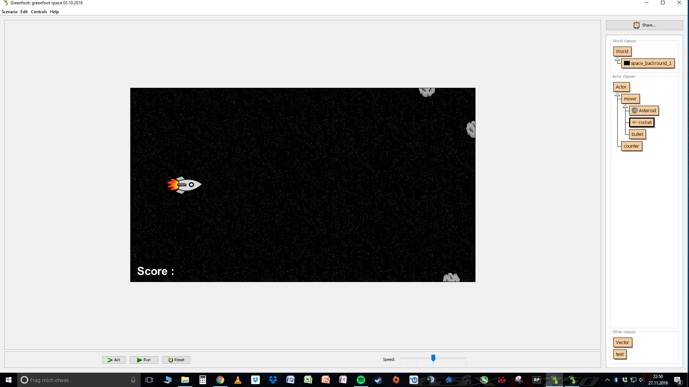
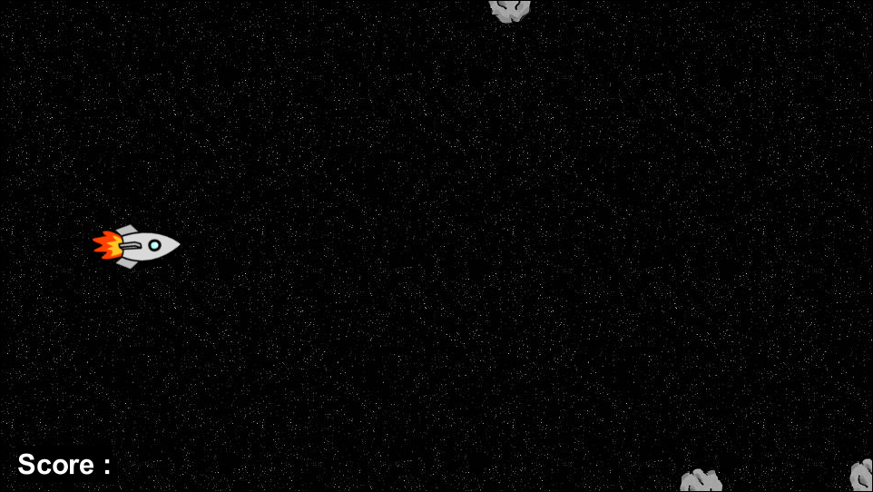

<!--
<head>
<style>
<h1> {color: green; TEXT-DECORATION: UNDERLINE;}</h1>
<h2> {color: green; TEXT-DECORATION: UNDERLINE;}</h2>
<h3> (color: green; TEXT-DECORATION: UNDERLINE;}</h3>
</style>
</head>

<body>
<style>
h1 {color: green; TEXT-DECORATION: UNDERLINE;}
h2 {color: green; TEXT-DECORATION: UNDERLINE;}
h3 (color: green; TEXT-DECORATION: UNDERLINE;}
</style>
</body>
-->

<h1>
SpaceRocket
</h1>

<h2>
Ein Informatik-Projekt von Robin Wagner und Finn Westphal
</h2>

<p></p>

<ul>
<li><a href= "#Einleitung"> 1. Einleitung: Anforderungen und Elemente des Spiels</a></li>
<li><a href= "#Umsetzung"> 2. Umsetzung</a></li>
    <ul>
    <li><a href= "#Das Szenario"> 2.1 Das Szenario</a></li>
        <ul>
        <li><a href= "#Erstellen einer Welt"> 2.1.1 Erstellen einer Welt</a></li>
        <li><a href= "#Objekte in der Welt"> 2.1.2 Objekte in der Welt</a></li>
        <li><a href= "#Die Rakete als Actor"> 2.2.1 Die Rakete als Actor</a></li>
        </ul>
    <li><a href= "#Die Rakete"> 2.2 Die Rakete</a></li>
        <ul>
        <li><a href= "#Die Rakete als Actor"> 2.2.1 Die Rakete als Actor</a></li>
        <li><a href= "#Bewegung und Rotation" 2.2.2 Bewegung und Rotation></a></li>
        <li><a href= "#Steuerung Rakete"> 2.2.3 Steuerung</a></li>
        <li><a href= "#Code-Zusammenfassung Rakete"> 2.2.4 Code-Zusammenfassung</a></li>
        </ul>
    <li><a href= "#Die Asteroiden"> 2.3 Die Asteroiden</a></li>
        <ul>
        <li><a href= "#Anforderungen"> 2.3.1 Anforderungen</a></li>
        <li><a href= "#Variablen der Asteroiden-Klasse"> 2.3.2 Variablen der Asteroiden-Klasse</a></li>
        <li><a href= "#Zufällige Bewegung der Asteroiden"> 2.3.3 Zufällige Bewegung der Asteroiden</a></li>
        <li><a href= "#Am Rand der Welt"> 2.3.4 Am Rand der Welt</a></li>
        <li><a href= "#Code-Zusammenfassung Asteroiden" 2.3.5 Code-Zusammenfassung></a></li>
        </ul>
    </ul>
<li><a href= "#Was noch zu tun ist"> 3. Was noch zu tun ist</a></li>
<li><a href= "#Quellen"> 4. Quellen</a></li>
</ul>

<h2>
<a id="Einleitung">1. Einleitung: Anforderungen und Elemente des Spiels</a>
</h2>

Space Rocket ist ein Highscore-Spiel auf Greenfoot-Basis, in dem man mit einer Rakete, die sich am linken Bildschirmrand befindet und sich nur nach oben oder unten bewegen kann, versucht, Asteroiden, die nur von der rechten Bildschirmseite heranfliegen, in einem Asteroidenfeld auszuweichen. Jeder Asteroid verschwindet aus der Welt, wenn er den Rand der Welt erreicht. Man verliert, wenn man mit einem Asteroiden zusammenstößt.

<h2>
<a id="Umsetzung"> 2. Umsetzung</a>
</h2>

<h3>
<a id= "Das Szenario"> 2.1 Das Szenario</a>
</h3>

<p>

<p>
Wir programmieren unser Projekt "SpaceRocket" in der Programmierumgebung "Greenfoot", die auf der objektorientierten Programmiersprache <i>Java</i> basiert. Zunächst haben wir festgelegt, welche Größe, welches Format und welche Auflösung unsere Welt haben soll. Unser Spiel soll über eine klassische Auflösung und ein klassischen Seitenverhälnis verfügen, damit es auf jedem Computer spielbar ist. Wir haben uns deswegen für das Seitenverhältis von 16/9 und eine Auflösung von 960 * 540 Pixeln entschieden. Diese Bildeigenschaften sind von den meisten aktuellen Displays umsetzbar.
</p>

<a id= "Erstellen einer Welt"> 2.1.1 Erstellen einer Welt</a>

<p>
Mit dem Konstruktor <i>public</i> erstellen wir eine Welt-Klasse namens <i>space_backround_1</i> und durch die Methode <i>import greenfoot.*;</i> geben wir an, dass diese Klasse in das Szenario implementiert werden soll. Fehlt diese Methode oder wird sie verändert, so würde diese Klasse beim Start des Programmes nicht geladen werden. Hinter jeder Klasse stehen mindestens eine geöffnete und eine geschlossene Klammer, die zusätzliche Parameter enthalten können. Zur Ausführung der Methoden, die wir verwenden, sind keine weiteren Parameter notwendig, weswegen bei uns nichts zwischen den Klammern steht. Die Referenz <i>super</i> sorgt dafür, dass alle Eigenschaften der Super- oder Hauptklasse auf alle anderen Klassen übertragen werden. In diesem Fall ist die Super-Klasse die generierte Welt. Diese Anweisung benötigt weitere Parameter für ihre Funktionalität und zwar die Auflösung der generierten Welt und das Verhältnis zwischen Pixeln und Zellen des Zellen-Koordinatensystems, das deckungsgleich zur generierten Welt erstellt wird. Wir wollen dieses Verhältnis auf 1:1 festlegen, sodass eine Zelle einem Pixel entspricht. Um diese Parameter dem Konstruktor zur Verfügung zu stellen, schreiben wir nach <i>super</i> in Klammern (960, 540, 1, true). Der erste Parameter definiert die Anzahl der Pixel entlang der x-Achse, der zweite nach dem Komma die Pixelanzahl in y-Richtung und der dritte Parameter "1" sagt aus, dass eine Zelle die Größe von einem Pixel in x- und y- Richtung besitzt. Das Größenverhältnis zwischen Zellen und Pixeln beträgt also 1:1. Durch den Parameter <i>true</i> erreichen wir, dass die Asteroiden und auch die Rakete zunächst nicht aus der Welt verschwinden können, da die Grenzen der Welt für sie eine Barriere darstellen. Am Ende dieser Zeile steht ein Semikolon, das verschiedene Methoden voneinander trennt. Danach haben wir in Greenfoot einen Hintergrund unserer Welt gesucht, der möglichst zum Spiel passen soll. Wir haben uns schließlich für den vorgefertigten Greenfoot-Hintergrund <i>space1</i> entschieden. Dieser lässt sich per Recht-Klick auf die Klasse unter der Option "Set image..." auswählen.
</p>

<pre><code><strong>Code-Script 1.1</strong>

import greenfoot.*;
public space_backround_1()
    {
        super(960, 540, 1, true);
    }
</code>
</pre>

<a id="Objekte in der Welt"> 2.1.2 Objekte in der Welt</a>

<p>
Bisher enthält unsere Welt noch keine Objekte, die agieren können und für unser Spiel relevant sind. Wir benötigen in jedem Fall zunächst eine Raketen- und eine Asteroiden-Klasse. Andere Klassen, die wir für unser Spiel später auch brauchen, z.B. eine Score- oder gamve-over Klasse, haben wir vorerst vernachlässigt. Zunächst wollten wir, dass jeweils vor Spielbeginn eine Rakete an einem festen Ort startet. Ebensfall sollen verschiedene Asteroiden an immer anderen Punkten der Welt, allerdings nur an den Rändern der rechten Welthälfte, spawnen. Dazu haben wir, wie in dem folgenden Befehl zu sehen (siehe Code-Script 1.2), mithilfe der Methode *addObject* eine Rakete hinzugefügt, die jedes Mal, wenn man das Spiel startet, an der Position x = 150 und y = 270 startet. Die Methode *addObject* benötigt bestimmte Parameter. Zu diesen zählt zum einen die Bezeichnung des zu generierenden Objektes einer Klasse und seine Position in der Welt. Hierzu wird nach <i>addObject</i> in Klammern die jeweilige Klasse mit dem Aufdruck <i>new</i> davor genannt, welcher als Referenz festlegt, dass ein Objekt dieser Klasse hinzugefügt werden soll. Schließlich geben zwei Parameter, durch Kommata getrennt, die Koordinaten des jeweiligen Objektes an. Diese Koordinaten haben wir so gewählt, dass die Rakete ziemlich weit links, aber nicht am Rand, startet und genau die Hälfte der Höhe besitzt.
</p>

<pre><code><strong>Code-Script 1.2</strong>

import greenfoot.*;
public space_backround_1()
    {
        super(960, 540, 1, true);
        addObject(new rocket(), 150, 270);
    }
</code></pre>

<p>
Weiterhin lassen wir Asteroiden spawnen, die sich an immer anderen Positionen befinden können. Der erste Asteroid hat die x-Koordinate 960 und befindet sich genau am rechten Rand der Welt mit einer y-Koordinate die von 0 bis 540, also von ganz unten bis ganz oben entlang der y-Achse variieren kann. Dies erreichen wir durch die Methode <i>Greenfoot.getRandomNumber</i>, die eine zufällige, natürliche Zahl zwischen 0 und dem jeweiligen in Klammern stehenden Grenzwert generiert. Der Grenzwert (hier: 541) ist dabei ausgeschlossen. Der 2. Asteroid kann zwischen den x-Koordinaten 480 und 480 + 480, also maximal 960 entstehen. Das bedeutet, dass er immer zufällig zwischen der Hälfte der Welt und dem rechten Rand spawnt. Die y-Koordinate beträgt 0, weshalb der Asteroid nur am oberen Rand der spawnen kann. Dem 3. Asteroid sind die gleichen x-Koordinaten zugewiesen, er spawnt aber durch die festgelegte y-Koordinate von 540 immer am unteren Rand. Seine x-Koordinate ist ebensfalls variabel, sodass er entland der y-Achse zufällig erscheinen kann. Der Counter hat in unserer Welt noch keine Bedeutung, da wir noch keine Counter-Klasse erstellt haben.
</p>

<pre><code><strong>Code-Script 1.3</strong>

addObject(new rocket(), 150, 270);
addObject(new counter(), 30, 510);
addObject(new Asteroid(), 960, Greenfoot.getRandomNumber(541) - 0);
addObject(new Asteroid(), Greenfoot.getRandomNumber(480) + 480, 0);
addObject(new Asteroid(), Greenfoot.getRandomNumber(480) + 480, 540);
</code></pre>

<p>
Zusammengefasst ergibt sich für die World-Klasse:
</p>

<pre><code><strong>Code-Script 1.4</strong>
import greenfoot.*;
public space_backround_1()
    {
        super(960, 540, 1, true);
        addObject(new rocket(), 150, 270);
        addObject(new counter(), 30, 510);
        addObject(new Asteroid(), 960, Greenfoot.getRandomNumber(541) - 0);
        addObject(new Asteroid(), Greenfoot.getRandomNumber(480) + 480, 1);
        addObject(new Asteroid(), Greenfoot.getRandomNumber(480) + 480, 540);
    }
</code></pre>

<h3>
<a id= "Die Rakete"> 2.2 Die Rakete</a>
</h3>

<p></p>

<a id="Die Rakete als Actor"> 2.2.1 Die Rakete als Actor</a>

<p>
Danach haben wir uns um die Rakete gekümmert. Diese soll sich zwar nicht nach links und rechts bewegen, da die Asteroiden auf die Rakete zufliegen sollen, aber sie soll sich nach oben und unten bewegen können. Zuerst haben wir ein Bild einer Rakete zur Actor-Klasse Rocket per Rechts-Klick auf die Rocket-Klasse unter der Option "Set image..." hinzugefügt. Mithilfe des Konstruktors *public* erstellten wir eine Klasse, die in der Lage ist, mit anderen Klassen Informationen austauschen. Auf diese Weise ist sie in der Lage mit anderen Klasse zu interagieren. Wir verwenden für die Rakete die Methode <i>void act()</i>. Der Rückgabetyp <i>void</i> gibt an, ob und wenn ja, welche Informationen zurückgegeben werden. In diesen Fall bedeutet <i>void</i> so viel wie "nichts", wir erhalten dementsprechend keine Informationen über die Ausführung der Methode. <i>void act()</i> ist ausschließlich eine ausführende Methode, die keine weiteren Parameter für ihre Ausführung benötigt, weswegen in den Klammern von <i>act()</i> kein Inhalt vorhanden ist. Sie wird beim starten des Szenarios, z. B. durch betätigen des <i>Act-Buttons</i>, kontinuierlich ausgeführt, bis das Szenario beendet wird. Dabei werden die einzelnen Methoden innerhalb von <i>act()</i> der Reihe nach ausgeführt. Wir legen mit dieser Methode das Verhalten der Rakete fest.
</p>

```javascript
Code-Script 2.1

import greenfoot.*;
public class rocket extends mover
{
public void act()
{
}
```

<a id="Bewegung und Rotation" 2.2.2 Bewegung und Rotation></a>

<p>
Hier haben wir mit den Befehlen <i>setRotation()</i> und <i>setLocation()</i> gearbeitet. Mithilfe von <i>setRotation</i> können wir die Neigung der Rakete bestimmen. Zur Steuerung der Rakete verwenden wir "w" für "nach oben" und "s" für "nach unten" oder alternativ die Pfeiltasten "up" und "down". Solange eine der Tasten gedrückt wird, soll sich die Rakete mit einer bestimmten, konstanten Geschwindigkeit in die jeweilige Richtung bewegen. Damit dies visuell verdeutlicht wird, soll gleichzeitig während des Tastendrucks die Rakete durch <i>setRotation</i> in einer bestimmte Neigung ausgerichtet werden.
Um diese Steuerung in Greenfoot umzusetzen, haben wir unnächst festgelegt, dass die Rakete horizontal ausgerichtet ist, weswegen wir zuerst in der Methode <i>setRotation</i> den Parameter für den Rotationswinkel gleich null gesetzt haben.
</p>

<pre>
<code><strong>Code-Script 2.2</strong>
   {
      setRotation(0);
   }
</code></pre>

<p>
Damit sich die Rakete beim Tastendruck mit konstanter Geschwindigkeit nach unten bewegt, verwenden wir die Methode <i>setLocation</i>, die mindestens drei weitere Parameter für ihre Funktion benötigt, welche die aktuelle Position des Objektes in der Welt und die Bewegungsrichtung relativ zu dieser Position ist. Die Rückgabetypen <i>getX</i> und <i>getY</i> geben die aktuellen Koordinaten des klassenspezifischen Objektes an. Sie werden durch ein Komma getrennt und in den Klammern der Methode <i>setLocation</i> integriert. Damit nun beim Tastendruck eine Bewegung vollzogen wird, kann man hinter jedem Rückgabetypen eine natürliche Zahlen addiert bzw. subtrahiert werden. So wird bei jeder Ausführung dieses frames oder Blocks das Objekt um die jeweiligen addierten bzw. subtrahierten Koordinaten bewegt. Durch das mehrfache Ausführen dieser Methode resultiert daraus eine lineare Fortbewegungsrichtung. Für unsere Anwendung soll sich unser Objekt, die Rakete, lediglich entlang der y-Achse bewegen, weswegen die x-Koordinate unverändert bleibt.
</p>

<pre><code>Code-Script 2.3
setLocation(getX(), getY()+12);
</code></pre>

<p>
Zur visuellen Verdeutlichung der Bewegung verwenden wir außerdem die Methode <i>setRoation</i>, die das Objekt, in diesem Fall unsere Rakete, in einem bestimmten Winkel ausrichtet. Dieser Winkel wird in Klammern an die Methode ergänzt. Durch ausprobieren haben wir herausgefunden, dass eine Rotation von 20° bzw. -20° geeignet für die simulierte Bewegung unser Rakete ist.
</p>

<a id="Steuerung Rakete"> 2.2.3 Steuerung</a>

<p>
Die Rakete soll außerdem nur beim Tastdruck ihre Position verändern und nicht in der Lage sein die Welt über ihre Grenzen zu verlassen. Um diese Bedingungen mit der Bewegung der Rakete in Verbindung zu bringen, verwenden wir eine <i>if-Methode</i>, die die Ausführung einer oder mehrerer Methoden nur zulässt, wenn alle ihre Bedingungsparameter erfüllt werden. Werden die in runden Klammern stehenden Bedingungen erfüllt, so werden die in geschweiften Klammern stehende Methode oder Methoden im Anschluss an die if-Methode ausgeführt. In unserem Fall bestehen unsere Bedinungsparameter aus zwei <i>Greenfoot.isKeyDown</i>-Methoden und dem Rückgabetyp <i>getY()</i>. Die Methode <i>Greenfoot.isKeyDown</i> prüft ständig, ob eine bestimmte Taste auf der Tastatur gedrückt wird. Dabei wird der jeweilige Tastenname in Anführungszeichen in Klammern an die Methode ergänzt. Da die Steuerung optional über die Pfeiltasten "oben" und "unten", sowie über die Tasten "w" und "s" erfolgen soll, verwenden wir <i>Greenfoot.isKeyDown</i> zweimal pro if-Methode. Für die Abwärtsbewegung bespielsweise verwenden wir <i>Greenfoot.isKeyDown("down")</i> und <i>Greenfoot.isKeyDown("s")</i>, die durch zwei senkrechte Striche "||" voneinander getrennt werden. Diese bilden einen Operator, in diesem Fall einen arithmetischen Ausdruck, der soviel wie "oder" bedeutet. Damit die Rakete die Welt nicht verlassen kann haben wir den Rückgabetyp <i>getY()</i> als kleiner als 540 festgelegt, was der maximalen y-Koordianten unserer Welt entspricht. Er wird mit zwei Et-Zeichen "<span>&amp;&amp;</span>" an die beiden <i>Greenfoot.isKeyDown</i> ergänzt. Die beiden Et-Zeichen ergeben ebenfalls einen Operator mit der Bedeutung "und". Daraus folgt, dass die Bedingung der if-Methode nur erfüllt ist, wenn mindestens einer der Tasten "down" oder "s" gedrückt wird und die aktulle Position der Rakete eine kleinere y-Koordinate als 540 aufweist. Werden die Bedingungen erfüllt, bewegt sich die Rakete mit einer Geschwindigkeit von 12 Pixeln pro frame-Ausführung entlang der y-Achse in Richtung der unteren Kante der Welt.
</p>

<pre><code>Code-Script 2.4
if (Greenfoot.isKeyDown("down") || Greenfoot.isKeyDown("s") <span>&amp;&amp;</span> getY() <span>&gt;=</span> 540)
   {
      setRotation(20);
      setLocation(getX(), getY()+12);
   }
</code></pre>

Äquivalent dazu ergibt sich für die Aufwärtsbewegung:

<pre><code><strong>Code-Script 2.5</strong>
if (Greenfoot.isKeyDown("up") || Greenfoot.isKeyDown("w") <span>&amp;&amp;</span> getY() <span class="sy0">&gt;=</span> 0)
   {
   setRotation(-20);
   setLocation(getX(), getY()-12);
   }
</code></pre>

<p>
Hier wurden "down" und "s" durch "up" und "w" ersetzt und der der Rückgabewert <i>getY</i> größer gleich 0 gesetzt. Dadurch ist die Bedingung der if-Methode nur erfüllt, wenn die "up"- oder "w"-Taste gedrückt und die aktuelle y-Koordinaten der Rakete größer als 0 ist. Somit kann die Rakete die Welt nicht an der oberen Kante verlassen. Die Neigung der Aufwärtsbewegung ist betragsgleich der Neigung der Abwärtsbewegung, jedoch ist sie negativ, sodass die Rakete gegen dem Uhrzeigersinn sich mit 20° um die eigene Achse rotiert. In der Methode <i>setLocation</i> wird der Rückgabetyp <i>getY</i> mit 12 subtrahiert, sodass sich die Rakete nach oben anstatt nach unten bewegt.
</p>

<a id="Code-Zusammenfassung Rakete"> 2.2.4 Code-Zusammenfassung</a>

<p>
Zusammengefasst ergibt sich für den Code der Rakete:
</p>

```javascript
Code-Script 2.6

import greenfoot.*;
public class rocket extends mover
{
public void act()
{
   setRotation(0);
    
   if (Greenfoot.isKeyDown("down") || Greenfoot.isKeyDown("s") <span>&amp;&amp;</span> getY() < 540)
   {
      setRotation(20);
      setLocation(getX(), getY()+12);
   }
   if (Greenfoot.isKeyDown("up") || Greenfoot.isKeyDown("w") && getY() > 0)
   {
   setRotation(-20);
   setLocation(getX(), getY()-12);
   }
}
}
```

<h3>
<a id= "Die Asteroiden"> 2.3 Die Asteroiden</a>
</h3>

<p></p>

<a id="Anforderungen"> 2.3.1 Anforderungen</a>

<p>
Anschließend haben wir uns um die Programmierung der Asteroiden gekümmert, in die wir bisher am meisten Zeit hineingesteckt haben. Zu Beginn haben wir eine Asteroiden-Klasse namens "Asteroid" erstellt und ihr die Bilddatei rock.png zugeortnet, die Greenfoot standardmäßig zur Verfügung stellt. Die Asteroiden sollen während der Ausführung des Szenarios zufällig spawnen und sich von rechts nach links mit einem zufälligen Winkel in Richtung der Rakete bewegen. Sobald sie auf den Rand der Welt zufliegen, sollen sie aus dem Szenario entfernt werden. Um diese Anforderungen zu erfüllen, benötigen wir eine Methode, die in der Lage ist, einen Asteroiden zu entfernen, wenn er sich am Rand der Welt befindet. Außerdem brauchen wir eine weitere Methoden, die den Asteroiden eine feste Geschwindigkeit und einen zufälligen Winkel zuweisen.
</p>

<a id="Variablen der Asteroiden-Klasse"> 2.3.2 Variablen der Asteroiden-Klasse</a>

<p>
Bei der Programmierung der Asteroiden haben wir zunächst zwei Variablen definiert, um den Code übersichtlicher zu gestalten. Diese Variablen legen die Richtung fest, in die sich die Asteroiden bewegen. Hierfür verwenden wir den primitiven Datentyp <i>Integer</i>, kurz <i>int</i>, welcher eine 32-Bit-Codierung aufweist. Das Zahlenspektrum dieses Datentyps umfasst 2³² ganze Zahlen von -2.147.483.648 bis 2.147.483.647. Da für die Winkeldefinition in Greenfoot das Winkelmaß Grad verwendet wird, ist dieser Zahlenbereich mehr als ausreichend. Die Snytax für Variablen setzt sich aus der Art des Datentyps und dem Namen der Variablen zusammen, die dem zugeordneten Zahlenwert durch ein Gleichheitszeichen gleichgesetzt werden.
</p>

```javascript
Code-Scipt 3.01

int [Name der Variablen] = ...
```

<p>
Da sich die Asteroiden mit einem zufälligen Winkel fortbewegen sollen, verwenden wir die bekannte Methode <i>Greenfoot.getRandomNumber</i> für die Winkelvariable names <i>Angle</i> (engl. Winkel). Diese Methode generiert jedoch nur natürliche Zahlen. Ohne Weiteres lassen sich also nur Winkel im Uhrzeigersinn erzeugen. Somit sind  die Asteroiden lediglich in der Lage, eine Aufwärtsbewegung zu erfahren. Aus diesem Grund haben wir eine weitere Variable mit der Bezeichnung <i>TypeOfRotation</i> festgelegt, deren Funktion später noch genauer erläutert wird. Wir haben die Variable für den Winkel (Angle) gleich <i>Greenfoot.getRandomNumber(50)</i> gesetzt, wodurch die zufällige Zahl von 0 bis 49 generiert wird. Die Variable <i>TypeOfRotation</i> erstellt durch den Grenzwert <i>(2)</i> zufällig eine 0 oder eine 1. Der Wert dieser Variable kann also nur zwei Zustände annehmen.
</p>

```javascript
Code-Script 3.02

import greenfoot.*;
int Angle = Greenfoot.getRandomNumber(50);
int TypeOfRotation = Greenfoot.getRandomNumber(2);
```

<a id="Zufällige Bewegung der Asteroiden"> 2.3.3 Zufällige Bewegung der Asteroiden</a>

<p>
Da sich die Asteroiden mit einer konstanten Geschwindikeit bewegen sollen, können wir die Methode <i>move()</i> verwenden. Sie funktioniert in Verbindung mit <i>act()</i>. Mit dieser Methode lassen sich Objekte entlang der x-Achse bewegen. Sie benötigt einen Parameter, eine Zahl, in ihrem Klammerausdruck. Dabei definiert das Vorzeichen die Richtung, in die sich das Objekt bewegt (positiv: von links nach recht, negativ: von rechts nach links) und der Betrag des Zahlenwertes das Tempo mit der sich das Objekt vorbewegt. Durch Ausprobieren haben wir herrausgefunden, dass ein Tempo von 12 geeignet für unser Spiel ist. Das Vorzeichen der Geschwindikeit ist negativ, weil sich die Asteroiden von rechts nach links bewegen sollen.
</p>

```javascript
Code-Script 3.03

public void act()
{
   move(-12)
}
```

<p>
Bisher sind die Asteroiden nur in Lage sich horizontal fortzubewegen. Wir haben bereits eine zufällige Variable für die Winkeleinstellung der Asteroiden. Mithilfe von <i>setRotation()</i> können wir diese nutzen um die Neigung der Asteroiden festzulegen. Um die Werte von der Variable "Angle" abzurufen, müssen wir die Variablenbezeichnung als Parameter in die Klammern in <i>setRotation</i> implementieren.
</p>

```javascript
Code-Script 3.04

setRotation(Angle)
```

<p>
Jetzt können die Asteroiden nur eine horizontale Bewegung oder eine Aufwärtsbewegung erfahren, weil nur Winkeleinstellungen gegen den Uhrzeigersinn möglich sind. Hier kommt die Variable <i>TypeOfRotation</i> ins Spiel. Sie kann nur zwei Zustände (0 und 1) annehmen. Dies können wir uns zu nutzen machen, indem wir über diese Variable das Vorzeichen des Winkels bestimmen. Auf diese Weise lässt sich eine Winkeleinstellung mit und gegen den Uhrzeigersinn vornehmen, indem wir die beiden Zustände von <i>TypeOfRotation</i> mit Bedingungen verknüpfen. Wir können z. B. festlefen, dass der Winkel positiv (mit dem Uhrzeigersinn ausgrichtet) ist, wenn <i>TypeOfRotation</i> den Wert 0 annimmt. Äquivalent wäre der Winkel mit einem negativen Vorzeichen versehen, wenn <i>TypeOfRotation</i> 1 ist. Der Winkel würde sie dadurch gegen den Uhrzeigersinn ausrichten. Diese Bedingungen lassen sich mit der bekannten if-Methode definieren. Dabei sind die Bedingungen, dass <i>TypeOfRotation</i> 0 bzw. 1 ist. Die Werte 0 und 1 werden durch den aritmetischer Ausdruck "==" gleichgesetzt, welcher so viel wie "ist gleich" bedeutet. Die ausgeführten Anweisungen sind dementsprechend die Methoden <i>setRotation</i> mit positivem bzw. nagativem Vorzeichen. Da eine der Bedingungen (0 oder 1) immer erfüllt ist, bewegen sich die Asteroiden immmer mit einem zufälligen Winkel. Somit haben wir die Bewegung der Asteroiden charakterisiert.
</p>

```javascript
Code-Script 3.05

public void act()
{
    move(-12);
    if (TypeOfRotation == 0);
    {
        setRotation(Angle);
    }
    if (TypeOfRotation == 1)
    {
        setRotation(-Angle);
    }
}
```

<a id="Am Rand der Welt"> 2.3.4 Am Rand der Welt</a>

<p>
Die Asteroiden sollen entfernt werden, sobald sie die Ränder der Welt erreichen. Es muss also ständig geprüft werden, ob sich ein Asteroid am Rand der Welt befindet. Dies ist ein sehr spezieller Aufgabentyp für den keine vorfertigte Methode vorhanden ist, weshalb wir eine eigene Methode definieren müssen. Wir haben diese Methode <i>atWorldEdge()</i> genannt, was so viel wie "am Rand der Welt bedeutet". Im Gegensatz zu der bisher verwendeten Mehtode <i>act()</i> muss <i>atWorldEdge()</i> über Rückgabetypen verfügen, damit die Methode in Lage ist Informationen zurückzugeben. In diesem soll die Methode angeben, ob sich ein Asteroid am Rand der Welt befindet oder nicht. Da dies binäre Aussagen sind, sind boolesche Rückgabetypen sinnvoll. Boolesche Aussagen (Literale) können nur zwei Züstände annehmen und zwar <i>true</i> und <i>false</i>, welche auf deutsch so viel wie <i>richtig</i> und <i>falsch</i> bedeuten.
</p>

```javascript
Code-Script 3.06

public boolean atWorldEdge()
{
}
```

<p>
Damit <i>atWorldEdge</i> funktionieren kann, müssen ihre Rückgabetypen definiert werden. Diese werden als Teil der Methode in dessem Block implementiert. Hierfür benötigen wir die Anweisung <i>return</i>, die verschiedene Ausdrücke wie z. B. "wahr" oder "falsch" als Rückgabetypen zurückgeben kann. Dabei wird der Inhalt zwischen <i>return</i> und dem Semikolon als Rückgabetyp festgelegt.
</p>

```javascribt
Code-Script 3.07

return [Rückgabetyp] ;
```

<p>
In unserem Fall verwenden wir als Rückgabetypen <i>true</i> und <i>false</i>, die Aufschluss darüber geben sollen, ob sich ein Asteroid am Rand der Welt befindet oder nicht.
</p>

```javascript
Code-Script 3.08

public boolean atWorldEdge()
{
   return true;
}
```

<p>
Würde man die obige Programmierzeilen verwenden, so würde die Methode ständig den Rückgabetyp <i>true</i> zurückgeben. Die Rückgabetypen "wahr" und "falsch" müssen an Bedingungen verknüpft werden, damit sie sinnvoll eingesetzt werden können. Um herrauszufinden, ob sich ein Asteroid am Rand der Welt befindet, müssen die Positionskoordinaten der Asteroiden bekannt sein. Diese lassen sich mit den Methoden <i>getX()</i> und <i>getY()</i> abrufen. Erreicht ein Asteroid z. B. den linken Rand der Welt, so soll <i>atWorldEdge()</i> den Rückgabetyp <i>true</i> zurückgeben. Um den linken Rand zu erreichen muss die x-Koordinate gleich null sein. Der Rückgabetyp der Methode <i>getX()</i> muss also gleich null sein. Im Javascript (siehe Code ) verwenden wir hierfür den Operator "==", der als aritmetischer Ausdruck "ist gleich" bedeutet.
</p>

<pre><code>Code-Script 3.09
getX() == 0
</code></pre>

<p>
Diesen Ausdruck können wir als Bedingung für eine if-Methode verwenden. In den geschweiftern Klammern der if-Methode legen wir fest durch <i>return true</i> fest, dass, wenn ein Asteroid eine Ortkoordinate von x = 0 aufweist, die Methode <i>atWorldEdge()</i> den Ausdruck <i>true</i> zurückschickt.
</p>

```javascript
Code-Script 3.10

public boolean atWorldEdge()
{
   if(getX() == 0)
   {
      return true;
   }
}
```   

<p>
Die Asteroiden sind bisher in Lage, die Welt über den linken Rand zu verlassen, der obere und untere stellen jedoch immer noch eine Barriere für die Asteroiden dar. Äquivalent zum linken Rand wäre es naheliegend, wenn weitere if-Methoden mit den maximalen y-Koordianten (0 und 540) aufgestellt werden und so die Ränder passierbar gemacht werden. Hier taucht jedoch ein Problem auf: Erscheinen die Asteroiden beim Start des Szenarios in der Welt würden sie direkt als "am Rand der Welt" gekennzeichnet werden, was sie aus der Welt entfernen würde. Das liegt daran, dass die Asteroiden die Welt an den gleichen y-Koordinaten betreten und verlassen.
</p>

```javascript
Code-Script 3.11

public boolean atWorldEdge()
{
   if(getY() == 0 || getY() == 539)
   {
      return true;
   }
}
```

<p>
Wir müssen also zwischen den Asteroiden unterscheiden, die das Szenario betreten und denen, die es verlassen. Zur Unterscheidung könnte beispielsweise die Richtung dienen in der sich die Asteroiden relativ zu den Rändern bewegen. Wir können also zwischen den Asteroiden unterscheiden, die sich auf die Grenzen der Welt zubewegen und denen, die im Begriff sind, sich durch das Szenario zu bewegen. Hier kommt wieder Variable <i>TypeOfRotation</i> ins Spiel. Sie legt fest, ob sich die Asteroiden in einer Aufwärtsbewegung oder einer Abwärtsbewegung befinden. Ihr Wert gibt damit auch Aufschluss darüber, auf welchen Rand sich die Asteroiden zubewegen. Ein Asteroid, der eine Aufwärtsbewegung erfährt, bewegt sich auf den oberen Rand zu. Für eine Aufwärtsbewegung muss die Variable <i>TypeOfRotation</i> positiv sein (siehe Code-Script 3.05). Bewegt sich ein Asteroide auf den oberen Rand zu, so erreicht er irgendwann die Koordinaten (x|0). Wenn beide Bedinunngen erfüllt sind, soll der Asteroid entfernt werden. Wir formulieren also als Bedingung in einer if-Methode, dass, wenn die y-Ortskoordinate gleich 0 ist und die Variable <i>TypeOfRotation</i> gleich 0 ist, der Rückgabetyp <i>true</i> von <i>atWorldEdge</i> zurückgegeben wird. Hierfür verwenden wir arithmetischen Ausdruck "<span>&amp;&amp;</span>", der so viel wie "und" bedeutet. Es müssen beide Bedingungen erfüllt sein, um den Rückgabetyp <i>true</i> zurückzugeben. 
</p>

```javascript
Code-Script 3.12

public boolean atWorldEdge()
{
    if(getX() == 0)
    {
        return true;
    }
    if(getY() == 0 && TypeOfRotation == 0)
    {
        return true;
    }
}
```

<p>
Äquivalent zur Aufwärtsbewegung gilt für den unteren Rand, dass die Variable <i>TypeOfRotation</i> gleich 1 sein muss und dass die y-Koordinate der maximalen y-Koordiante des Szenarios entsprechen muss. Unser Szenrio hat eine Abmessungen von 960*540 Pixeln. Sowohl die x- als auch die y-Koordiantenachsen fangen bei 0 an. Das Pixel in der linken oberen Ecke weist die Koordinaten (0|0) auf. Da die Welt nur über 960*540 Pixel verfügt, hat das Pixel in der gegenüberliegenden, rechten unteren Ecke die Koordnaten (959|539). Dies sind gleichzeitig auch die betragsmaximalen Koordinaten der Welt. Daraus folgt, dass die Asteroiden entlang der y-Achse maximal die Ortskoordinaten (x|539) erreichen können. Deshalb muss die Methode <i>getY()</i> in der if-Bedingung gleich 539 gesetzt werden. Mithilfe des arithmetischen Ausdrucks "||" können wir die Bedinugnen für die Aufwärtsbewegung (<i>TypeOfRotation</i> ist gleich 0, <i>getY()</i> ist gleich 0 und die Abwärtsbewegung (<i>TypeOfRotation</i> ist gleich 1, <i>getY()</i> ist gleich 539) verbinden und in einer Bedingung zusammenfassen. Daraus ergibt sich:
</p>

```javascript
Code-Script 3.13

public boolean atWorldEdge()
{
    if(getX() == 0)
    {
        return true;
    }
    if(getY() == 0 && TypeOfRotation == 0 || getY() == 539 && TypeOfRotation == 1)
    {
        return true;
    }
}
```

<p>
Befinden sich die Asterioden nicht am Rand der Welt soll der Rückgabetyp <i>false</i> zugeschickt werden. Die lässt sich mit einer else-Anweisung um umsetzen. Sind die if-Bedingungen innerhalb einer Methoden nicht erfüllt, so werden stattdessen die Anweisungen der else-Methode umgesetzt.
</p>

```javascript
Code-Script 3.14

import greenfoot.*;
int Angle = Greenfoot.getRandomNumber(50);
int TypeOfRotation = Greenfoot.getRandomNumber(2);
public boolean atWorldEdge()
{
    if(getX() == 0)
    {
        return true;
    }
    if(getY() == 0 && TypeOfRotation == 0 || getY() == 539 && TypeOfRotation == 1)
    {
                      return true;
    }
    else
    {
        return false;
    }
}
```

<a id="Code-Zusammenfassung Asteroiden" 2.3.5 Code-Zusammenfassung></a>

 Fasst man Code-Script 3.05 und 3.14 zusammen, so ergibt sich für den Code der Asteroiden:

```javascript
Code-Script 3.15

import greenfoot.*;
public class Asteroid extends mover
{
   int Angle = Greenfoot.getRandomNumber(50);
   int TypeOfRotation = Greenfoot.getRandomNumber(2);
   public void act()
   {
       move(-12);
       if (TypeOfRotation == 0)
       {
           setRotation(Angle);
        }
       if (TypeOfRotation == 1)
       {
           setRotation(-Angle);
       }
       if (atWorldEdge())
       {
           getWorld().removeObject(this);
       }
   }
   public boolean atWorldEdge()
   {
      if(getX() == 0)
      {
          return true;
      }
      if(getY() == 0 && TypeOfRotation == 0 || getY() == getWorld().getHeight() - 1 && TypeOfRotation == 1)
      {
          return true;
      }
      else
      {
          return false;
      }
   }
}
```

<h3>
<a id= "Was noch zu tun ist"> 3. Was noch zu tun ist</a>
</h3>

<p>
Dies ist unser derzeitiger Stand zu unserem Spiel SpaceRocket, dennoch haben wir das Projekt noch längst nicht fertiggestellt da uns noch viele Dinge fehlen, die wir geplant haben:
</p>
1. Es sollen während des Spiel neue Asteroiden spawnen, die aber nur auf der rechten Hälfte entstehen können.
2. Wenn die Rakete einen Asteroiden berührt, soll es eine Explosion geben und der Spieler soll verlieren (game-over).
3. Das game-over, das erscheint, wenn man verliert, fehlt noch.
4. Das Einfügen und Programmieren eines Scores, der den Punktestand abhängig von der überlebten Zeit zählt und beim game-over angezeigt wird.
5. Das Hinzufügen anderer Objekte, wie z.B. Bomben, die explodieren können und sich ähnlich wie die Asteroiden verhalten
6. Das Einfügen einer Bullet-Klasse (und Programmieren), denn die Rakete soll später in bestimmten Abständen und mit bestimmter Munition schießen können.
7. Das Einfügen und Programmieren einer Counter-Klasse.
8. Das Einfügen von Sternen in den Hintergrund, die den Eindruck erwecken sollen, dass man mit der Rakete wirklich durch den Weltraum fliegt.
9. Das Einfügen von Sounds, z.B. bei der Explosion oder beim game-over.

<h3>
<a id="Quellen"> 4. Quellen</a>
</h3>
<ul>
<li>Michael Kölling: *Einführung in Java mit Greenfoot*. Pearson Education Deutschland GmbH, 2010</li>
</ul>
